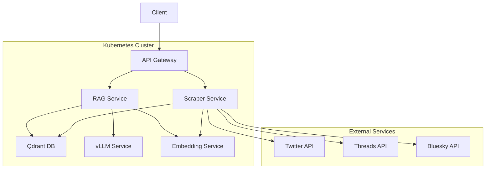

# Istio RAG Service

[](https://github.com/USERNAME/REPO_NAME/actions)
[](https://www.python.org/downloads/)
[](LICENSE)
[](https://fastapi.tiangolo.com/)
[](https://github.com/USERNAME/REPO_NAME/actions)

A Kubernetes-based Retrieval-Augmented Generation (RAG) service that scrapes social media content, indexes it in a vector database, and provides an API for querying with an LLM.

This service has been enhanced with modern Python development practices including:
- Configuration management using environment variables
- Comprehensive logging with detailed error reporting
- Rate limiting for API calls
- Data deduplication using SHA checksums
- Concurrent processing for improved performance
- Batch processing for efficient indexing
- Pydantic validation for API response validation

## Table of Contents

- [Architecture](#architecture)
- [Services](#services)
- [Prerequisites](#prerequisites)
- [Development Setup](#development-setup)
- [Deployment](#deployment)
- [API Endpoints](#api-endpoints)
- [Configuration](#configuration)

## Architecture

The system consists of multiple microservices orchestrated with Kubernetes and Istio service mesh:

1. **Scraper Service**: Collects social media posts from Twitter, Threads, and Bluesky
2. **RAG Service**: Handles user queries by retrieving relevant documents and generating responses
3. **Qdrant**: Vector database for storing and searching document embeddings
4. **vLLM**: High-throughput LLM inference engine
5. **Embedding Service**: Generates vector embeddings for text (referenced but not included in this repo)

## Services

### Scraper Service

- Collects posts from multiple social media platforms
- Generates embeddings for posts using the embedding service
- Stores posts and their embeddings in Qdrant

### RAG Service

- Accepts user queries
- Retrieves relevant documents from Qdrant
- Generates responses using vLLM

## Prerequisites

### For Kubernetes Deployment
- [Docker](https://docs.docker.com/get-docker/)
- [Kubernetes](https://kubernetes.io/docs/setup/) (minikube recommended for local development)
- [Istio](https://istio.io/latest/docs/setup/getting-started/)
- [kubectl](https://kubernetes.io/docs/tasks/tools/)
- [istioctl](https://istio.io/latest/docs/setup/getting-started/#download)

### For Local Development with Docker Compose
- [Docker](https://docs.docker.com/get-docker/)
- [Docker Compose](https://docs.docker.com/compose/install/)

## Project Architecture



## Local Development with Docker Compose

For local development without Kubernetes, you can use Docker Compose:

```bash
# Start all services
docker-compose up -d

# Check service status
docker-compose ps

# View logs
docker-compose logs -f

# Stop services
docker-compose down
```

Note: The docker-compose setup uses a lightweight model (facebook/opt-125m) for local development.
For production, you would use a more capable model.

## Development Setup

### Using UV (Recommended)

1. Install [UV](https://github.com/astral-sh/uv) (Python package manager)
2. Create and activate a virtual environment:
   ```bash
   uv venv .venv
   source .venv/bin/activate
   ```
3. Install dependencies for each service:
   ```bash
   cd services/rag_service && uv pip install -e . && cd ../..
   cd services/scraper_service && uv pip install -e . && cd ../..
   ```

### Traditional pip Setup

1. Create a virtual environment:
   ```bash
   python -m venv .venv
   source .venv/bin/activate
   ```
2. Install dependencies for each service:
   ```bash
   cd services/rag_service && pip install -e . && cd ../..
   cd services/scraper_service && pip install -e . && cd ../..
   ```

### Installing Test Dependencies

To run tests, install the test dependencies:

```bash
# Using UV (recommended)
uv pip install -e ./services/rag_service[test] -e ./services/scraper_service[test]

# Or using traditional pip
cd services/rag_service && pip install -e .[test] && cd ../..
cd services/scraper_service && pip install -e .[test] && cd ../..

# Or install both with pip
pip install -e ./services/rag_service[test] -e ./services/scraper_service[test]
```

## Deployment

### Option 1: Using Makefile (Recommended)

```bash
# Start minikube with appropriate resources
make start-minikube

# Install Istio
make install-istio

# Build container images
make microservice-container-build

# Deploy all services
make deploy

# Check deployment status
make health-check
```

### Option 2: Using Deployment Script

```bash
./deploy-rag.sh
```

### Option 3: Manual Deployment

1. Apply Kubernetes configurations in order:
   ```bash
   kubectl apply -f k8s/0-namespace.yaml
   kubectl apply -f k8s/1-istio-mtls.yaml
   kubectl apply -f k8s/2-vllm.yaml
   kubectl apply -f k8s/3-qdrant.yaml
   kubectl apply -f k8s/4-scraper-service.yaml
   kubectl apply -f k8s/5-rag-service.yaml
   kubectl apply -f k8s/6-observability.yaml
   ```

2. Build and push Docker images for the services:
   ```bash
   docker build -t rag-service ./services/rag_service
   docker build -t scraper-service ./services/scraper_service
   ```

3. Update the Kubernetes deployment files with the correct image names.

4. Initialize the Qdrant collection:
   ```bash
   kubectl exec -it deploy/qdrant -- curl -X PUT "http://localhost:6333/collections/posts" -H "Content-Type: application/json" -d '{
       "name": "posts",
       "vectors": {
           "size": 384,
           "distance": "Cosine"
       }
   }'
   ```

## API Endpoints

### Scraper Service

- `POST /scrape` - Start scraping social media platforms for posts matching a query
  ```json
  {
    "query": "technology",
    "platforms": ["twitter", "bluesky", "threads"]
  }
  ```

### RAG Service

- `POST /query` - Query the RAG system with a question
  ```json
  {
    "query": "What are the latest trends in AI?",
    "max_results": 5
  }
  ```

## Configuration

### Environment Variables

The services support comprehensive configuration through environment variables. All settings can also be configured via `.env` files.

#### Scraper Service Configuration:
- `TWITTER_TOKEN` - Bearer token for Twitter API v2 access
- `TWITTER_MAX_REQUESTS` - Maximum Twitter API requests (default: 300)
- `TWITTER_TIME_WINDOW` - Time window for Twitter rate limiting (default: 900 seconds)
- `THREADS_MAX_REQUESTS` - Maximum Threads API requests (default: 100)
- `THREADS_TIME_WINDOW` - Time window for Threads rate limiting (default: 3600 seconds)
- `BLUESKY_MAX_REQUESTS` - Maximum Bluesky API requests (default: 3000)
- `BLUESKY_TIME_WINDOW` - Time window for Bluesky rate limiting (default: 300 seconds)
- `BATCH_SIZE` - Number of posts to process in batches (default: 10)
- `HTTP_TIMEOUT` - HTTP request timeout in seconds (default: 30)
- `LOG_LEVEL` - Logging level (default: INFO)

#### RAG Service Configuration:
- `HTTP_TIMEOUT` - HTTP request timeout in seconds (default: 30)
- `MAX_TOKENS` - Maximum tokens for LLM responses (default: 500)
- `LOG_LEVEL` - Logging level (default: INFO)

### Kubernetes Secrets

Create a Kubernetes secret for API tokens:

```bash
kubectl create secret generic api-tokens -n rag-system \
  --from-literal=TWITTER_TOKEN=your_twitter_bearer_token
```

## Monitoring and Observability

The system includes observability configurations for monitoring the services:

- Prometheus metrics collection
- Grafana dashboards
- Jaeger distributed tracing
- Kiali service mesh visualization

## Security Scanning

The project includes automated security scanning in the CI pipeline:

- **Bandit**: Static analysis for common Python security issues
- **Safety**: Checks dependencies for known security vulnerabilities

To run security scans locally:

```bash
# Install security scanning tools
pip install -r requirements-security.txt

# Run bandit scan
bandit -r services/

# Run safety check
# Note: This requires actual requirements files with pinned versions
safety check
```

## Running Tests

To run the tests for both services:

```bash
# Run all tests
python run_tests.py

# Or run tests manually with pytest
pytest tests/ -v

# Run tests for a specific service
pytest tests/test_rag_service.py -v
pytest tests/test_scraper_service.py -v

# Check test file syntax (without running tests)
python check_test_syntax.py
```

## Troubleshooting

- Check pod status: `kubectl get pods -n rag-system`
- Check service logs: `kubectl logs -n rag-system deploy/<service-name>`
- Check Istio sidecar status: `istioctl proxy-status`